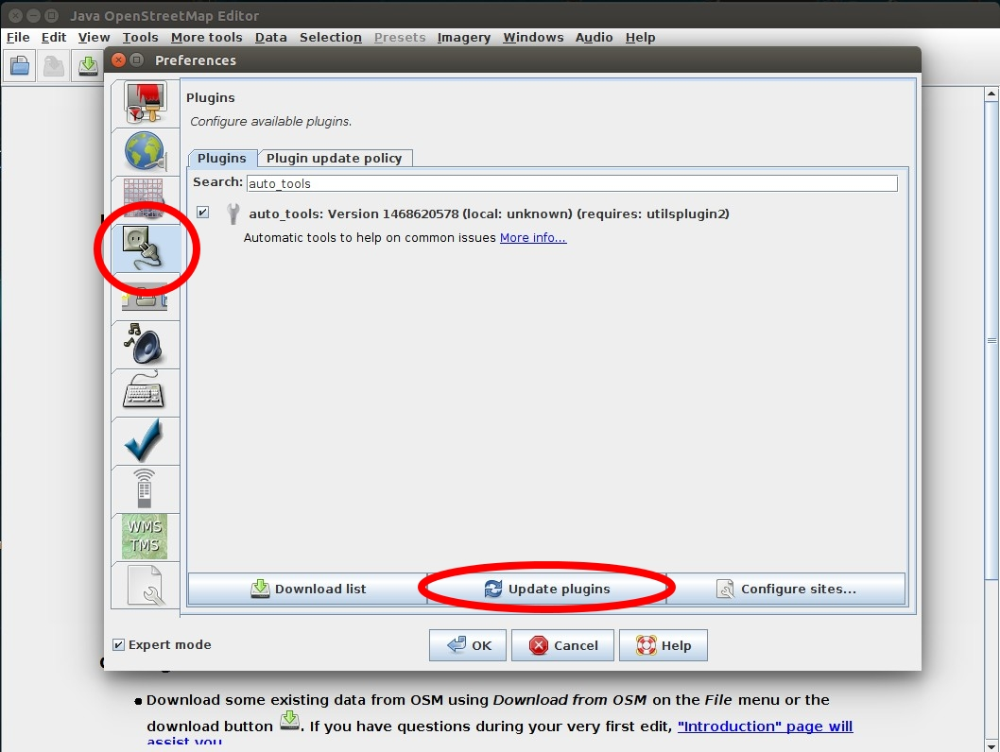
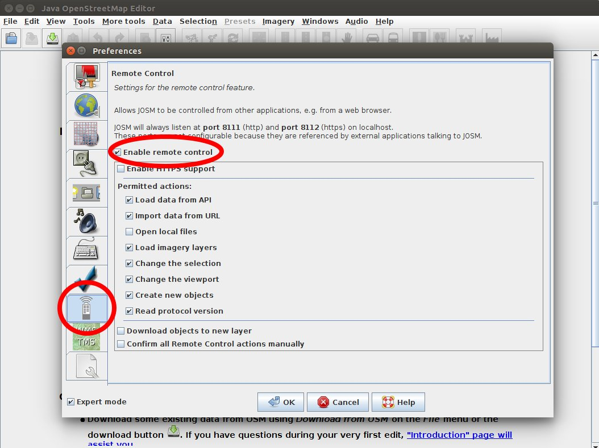
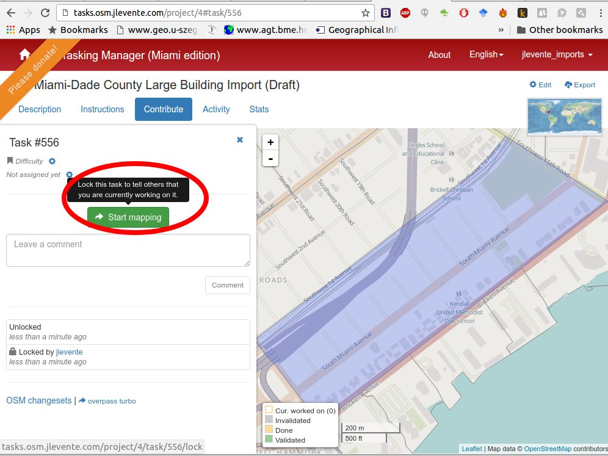
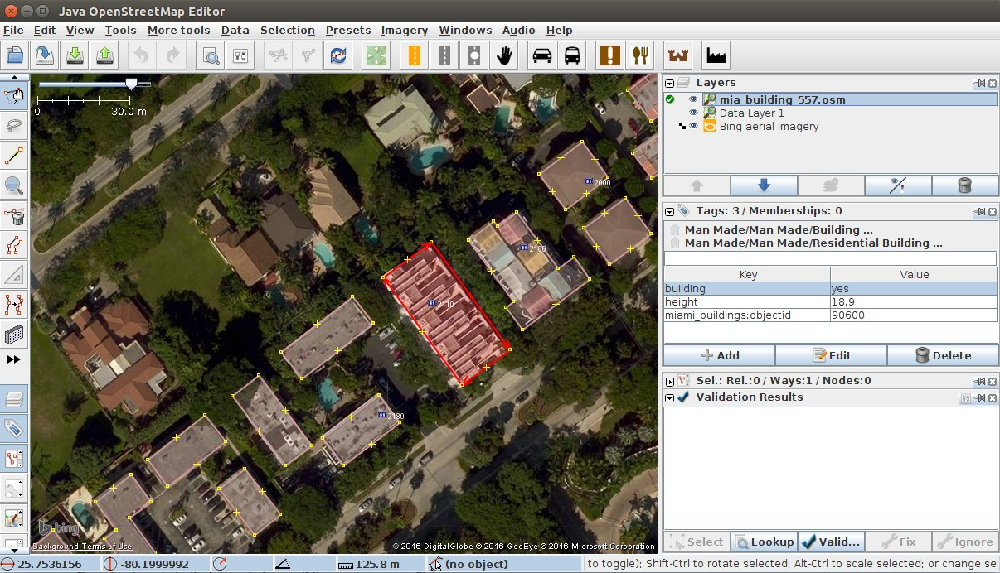
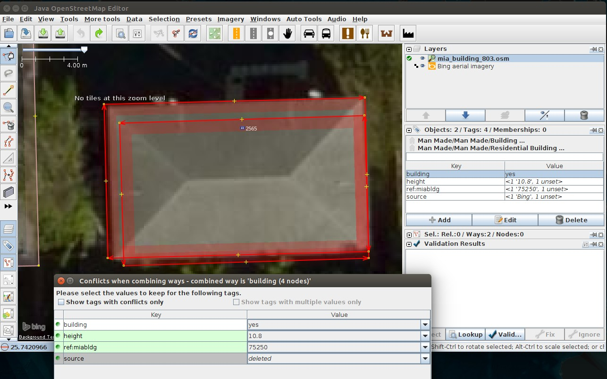
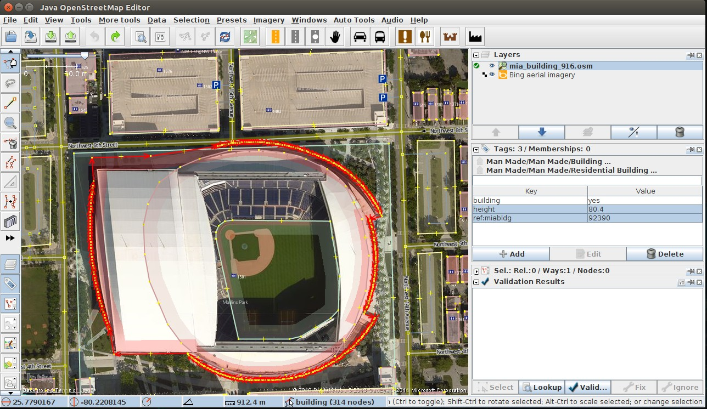

Miami-Dade County Building Import Tutorial
=============

**!! This import tutorial is inspired by and largely based on the work of the awesome people behind [LA County imports](https://github.com/osmlab/labuildings/blob/master/IMPORTING.md). !!**

### About this import

This import aims to put nearly 100,000 buildings on the map in Miami-Dade County from Miami-Dade County's open data repository.
We believe this will be a good asset for the community. Since the building count in OSM was very low prior to this import,
a huge number of them could have been imported automatically but obviously, a lot of buildings need to be reviewed by actual mappers. This is where your help is needed!

## Getting started

Before jumping into map editing, here are some info we'd like you to read.

### Creating an import account

First off, since data imports can be significantly different from what people would otherwise map, the common consensus requres you to create a dedicated import account,
so other people will instantly know that the data you insterted is from another source. Creating an import account also helps us monitor the progress.
The best is putting `_imports` (or `_miamibuildings`, etc.) after your existing OSM username (e.g. `jlevente_imports`).

### Getting familiar with OSM

If you are not familiar with OpenStreetMap and the JOSM editor, please check out these guides first and make sure you have a basic understanding of mapping.
To contribute to this project, you need to use the JOSM editor. Here are some resources to get you started:

- Download JOSM - https://josm.openstreetmap.de/wiki/Download
- LearnOSM - http://learnosm.org/en/josm/
- Mapbox Mapping wiki - https://www.mapbox.com/blog/making-the-most-josm/

### Getting familiar with the Tasking Manager

The tasks are organized on Tasking Manager (http://tasks.osm.jlevente.com). Check it out.

## Import workflow

### Install auto-tools plugin in JOSM

The good folks at Mapbox created a plugin to merge building shapes sliced by parcel boundaries. You can find it [here](https://github.com/mapbox/auto-tools).

Open JOSM and install it at **Edit -> Preferences -> Plugins**

### Activate JOSM remote control

The remote control is used to load data layers to JOSM directly from the Tasking Manager.

Open JOSM and activate Remote Control at **Edit -> Prefernces -> Remote Control**

### Select a task in the Tasking Manager

- Navigate to http://tasks.osm.jlevente.com and choose an area to work on.
- Click on **Start Mapping** (Now the task is locked and others know you're working on it)
- Download current OSM data by selecting **Edit in JOSM** (JOSM needs to be running) This will create a layer called `Data Layer 1` in JOSM
- Download the `*.osm` file specific to your task under the **Extra Instrucitons**. These are the buildings from our import set. A second layer called `mia_buildings_####.osm` will appear in JOSM.

- Click on **Imagery** and load a background layer. You can use **Bing** or **USGS Large Scale Imagery** that are both of decent quality.
- Your JOSM should look similar to this, with at least 2 data layers. `Data Layer 1` holds the current OSM data (greyed out if not Active) and `mia_building_####.osm` with the buildings to be reviewed.

## Importing

### Combining data layers

- Run the Validator and check for potential conflicts in each layer. Try to solve them.
- Select both layers in JOSM and merge them via **Right click -> Merge**. Target layer should be **`mia_building_####.osm`**. This step combines the 2 layers. You have to be very careful from this step on as now you have overlapping buildings.
- Buildings in the import set will always have `ref:miabld` (and `ref:miaaddr` for addresses) tags. You can use these to decide the original source of an OSM feature)

### Manually checking buildings

There are different scenarios you will want to look for. Keep in mind that you are working with buildings with potential conflicts. These conflicts can be the following:

**Remember** that you can alway tell which building is from the import set by checking for `ref:miabldg` tag.

- Buildings overlapping with existing OSM buildings
- Buildings with geometry errors
- Buildings near address tags
- Buildings overlapping with `highway=*` or `railway=*`

Let's look at some common cases you might encounter. Remember, you will want to upload the most accurate version of buildings/addresses that can be observed in these data sources. In short, you need to decide
which buildings are of better quality or whether to include an address or not.
The next section reviews the tools we recommend for this import and highlight some cases. **Remember** that you can alway tell which building is from the import set by checking for `ref:miabldg` tag.

#### Overlapping buildings

- If the import building is of higher quality, select both buildings and click on **More tools -> Replace Geometry**. Here you can decide which tags to keep and which ones to discard. This step will preserve the history of the building (i.e. the one that was already in OSM) with the new geometry. Make sure you don't keep tags like `source=Bing` accidentally.

- If the existing OSM building is of higher quality, you can just ignore the import building. However, make sure you copy the building height information as that is potentially useful along with the `ref:miabldg` tag. You can do it by selecting the desired tags on the import building, hitting **`ctrl`** + **`c`** (or right click `Copy selected Key(s)/Value(s)`), then selecting the other building and pressing **`ctrl`** + **`shift`** + **`v`**. Delete the import building by selecting it and pressing **`delete`**

Another useful tool comes with the **Auto tools** plugin. This tool combines the geometry and tags

[TODO]

#### Importing addresses

Addresses in the manual set are represented as nodes (i.e. not automatically attached to buildings). This is because you for some cases you can see multiple addresses for a single building.

- If you think that an address is unique to the underlying building, you can copy all the tags and paste it in the building. It is done by selecting the address node, selecting the tags and copying them by hitting **`ctrl`** + **`c`** or pressing right click +  `Copy selected Key(s)/Value(s)`. Paste the address tags to the building by hitting **`ctrl`** + **`shift`** + **`v`**. Finally delete the address node by selecting it and pressing **`delete`**.

...
