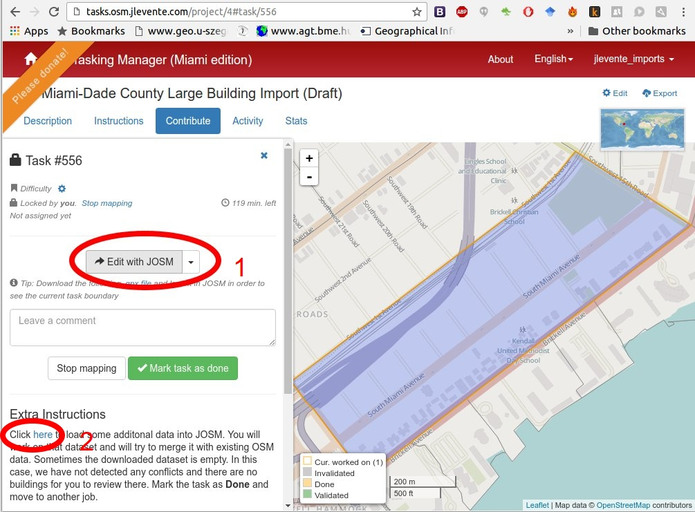
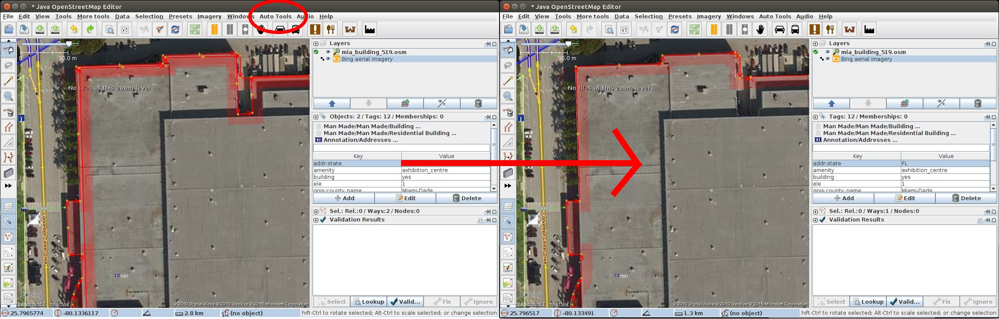
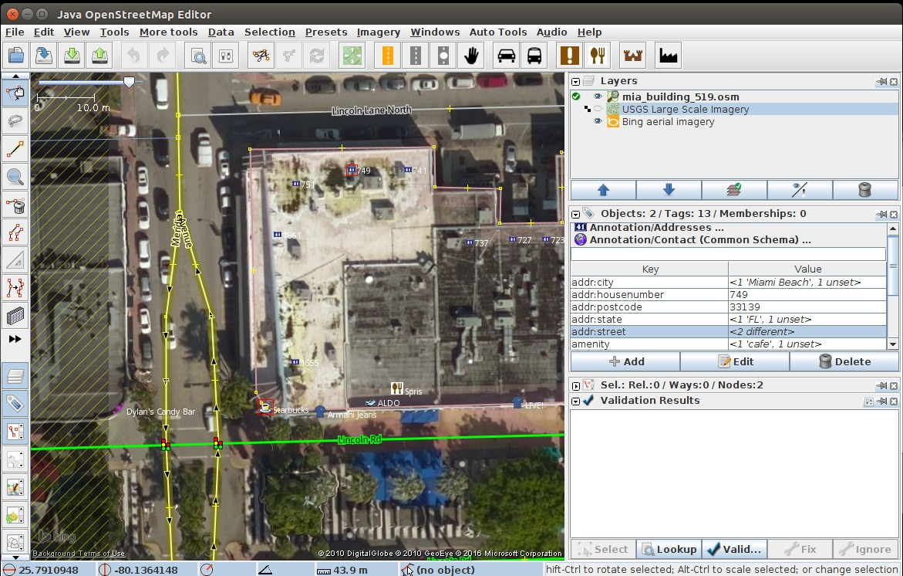
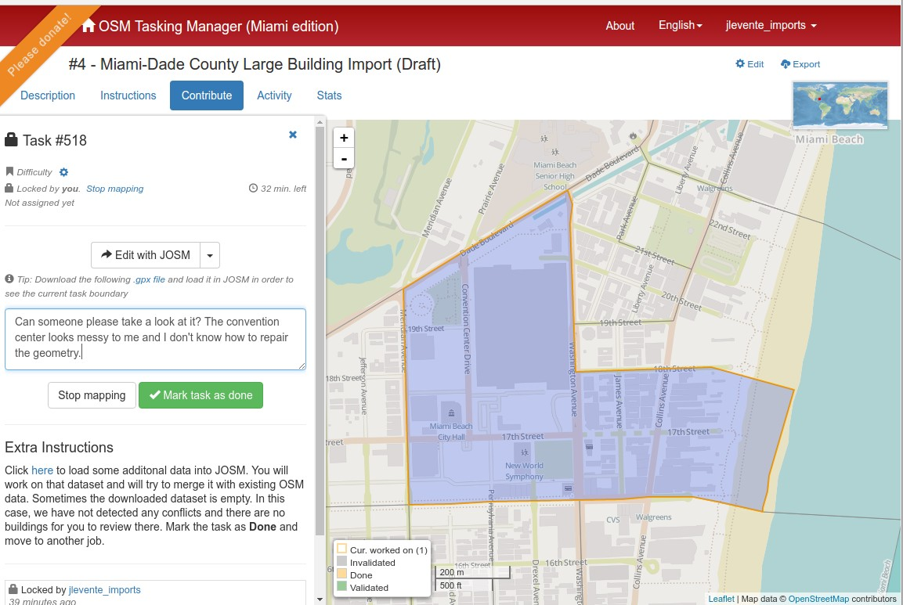
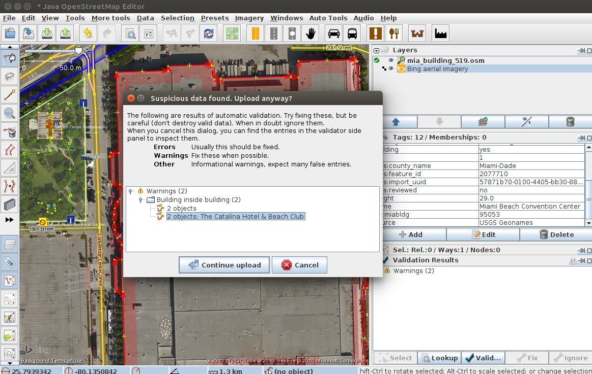
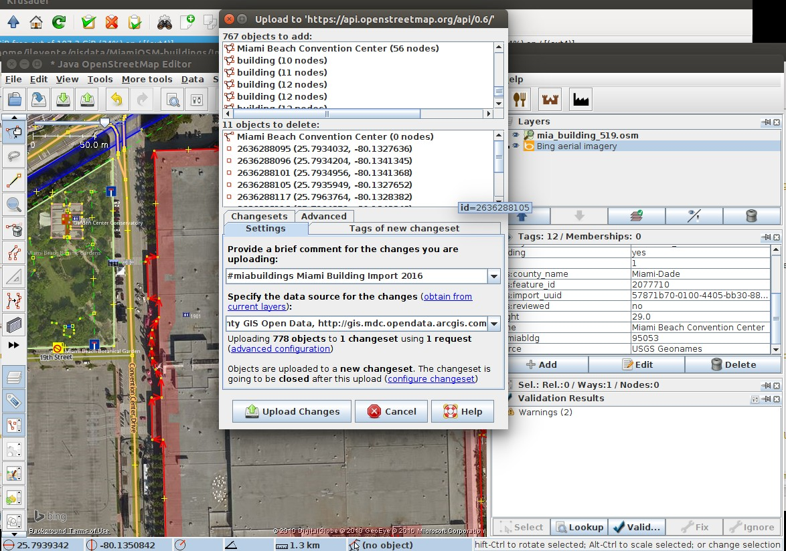

Miami-Dade County Building Import Tutorial
=============

**!! This import tutorial is inspired by and largely based on the work of the awesome people behind [LA County imports](https://github.com/osmlab/labuildings/blob/master/IMPORTING.md). !!**

### About this import

This import aims to put nearly 100,000 buildings on the map in Miami-Dade County from Miami-Dade County's open data repository.
We believe this will be a good asset for the community. Since the building count in OSM was very low prior to this import,
a huge number of them could have been imported automatically but obviously, a lot of buildings need to be reviewed by actual mappers. This is where your help is needed!

## Getting started

Before jumping into map editing, here are some info we'd like you to read.

### Creating an import account

First off, since data imports can be significantly different from what people would otherwise map, the common consensus requires you to create a dedicated import account,
so other people will instantly know that the data you insterted is from another source. Creating an import account also helps us monitor the progress.
The best is putting `_imports` (or `_miamibuildings`, etc.) after your existing OSM username (e.g. `jlevente_imports`). You can create your new account on the main [OpenStreetMap](http://www.openstreetmap.org/) site.

### Getting familiar with OSM

If you are not familiar with **OpenStreetMap** and the **JOSM editor**, please check out these guides first and make sure you have a basic understanding of mapping.
To contribute to this project, you need to use the JOSM editor. Here are some resources to get you started:

- Download JOSM - https://josm.openstreetmap.de/wiki/Download
- LearnOSM - http://learnosm.org/en/josm/
- Mapbox Mapping wiki - https://www.mapbox.com/blog/making-the-most-josm/

### Getting familiar with the Tasking Manager

The tasks are organized on Tasking Manager (http://tasks.osm.jlevente.com). Check it out.

## Import workflow

### Install auto-tools plugin in JOSM

The good folks at Mapbox created a plugin to merge building shapes sliced by parcel boundaries. You can find it [here](https://github.com/mapbox/auto-tools).

Open JOSM and install it at **Edit -> Preferences -> Plugins**

### Activate JOSM remote control

The remote control is used to load data layers to JOSM directly from the Tasking Manager.

Open JOSM and activate Remote Control at **Edit -> Prefernces -> Remote Control**

### Select a task in the Tasking Manager

- Navigate to http://tasks.osm.jlevente.com and choose an area to work on.
- Click on **Start Mapping** (Now the task is locked and others know you're working on it)
- Download current OSM data by selecting **Edit in JOSM** (JOSM needs to be running) This will create a layer called `Data Layer 1` in JOSM
- Download the `*.osm` file specific to your task under the **Extra Instrucitons**. These are the buildings from our import set. A second layer called `mia_buildings_####.osm` will appear in JOSM.

- Click on **Imagery** and load a background layer. You can use **Bing** or **USGS Large Scale Imagery** that are both of decent quality.
- Your JOSM should look similar to this, with at least 2 data layers. `Data Layer 1` holds the current OSM data (greyed out if not Active) and `mia_building_####.osm` with the buildings to be reviewed.

## Importing

### Combining data layers

- Run the Validator and check for potential conflicts in each layer. Try to solve them.
- Select both layers in JOSM and merge them via **`Right click`** -> **`Merge`**. Target layer should be **`mia_building_####.osm`**. This step combines the 2 layers. You have to be very careful from this step on as now you have overlapping buildings.
- Buildings in the import set will always have `ref:miabld` (and `ref:miaaddr` for addresses) tags. You can use these to decide the origin of a building)

### Manually checking buildings

There are different scenarios you will want to look for. Keep in mind that you are working with buildings with potential conflicts. These conflicts can be the following:

- Buildings overlapping with existing OSM buildings
- Buildings with geometry errors
- Buildings near address tags
- Buildings overlapping with `highway=*` or `railway=*`

Let's look at some common cases you might encounter. Remember, you will want to upload the most accurate version of buildings/addresses that can be observed in these data sources. In short, you need to decide
which buildings are of better quality or whether to include an address or not.
The next section reviews the tools we recommend for this import and highlight some cases. **Remember** that you can alway tell which building is from the import set by checking for `ref:miabldg` tag.

#### Overlapping buildings

- If the import building is of higher quality, select both buildings and click on **More tools -> Replace Geometry**. Here you can decide which tags to keep and which ones to discard. This step will preserve the history of the building (i.e. the one that was already in OSM) with the new geometry. Make sure you don't keep tags like `source=Bing` accidentally.

- If the existing OSM building is of higher quality, you can just ignore the import building. However, make sure you copy the building height information as that is potentially useful along with the `ref:miabldg` tag. You can do it by selecting the desired tags on the import building, hitting **`ctrl`** + **`c`** (or right click `Copy selected Key(s)/Value(s)`), then selecting the other building and pressing **`ctrl`** + **`shift`** + **`v`**. Delete the import building by selecting it and pressing **`delete`**

- Another useful tool comes with the **Auto tools** plugin. This tool combines the geometry and tags from two buildings (import an existing). It's useful when you can't decide if the existing building or the import building is better. Select both buildings, click on *`Auto Tools`* -> *`Combine LA buildings`*. Now you can edit the combined building (e.g. delete some nodes, change its shape, etc.). Don forget to check all tags + Pay attention to addresses (described below).

- The import dataset can be outdated. However, the background high resolution `Bing` imagery (i.e. when zoomed in) tends to be more recent (2014-2015 for most part of the county). A tool to check imagery dates is found [here](http://mvexel.dev.openstreetmap.org/bing/).
- If you find buildings that are missing from both OSM and from the import set, you can add them based on `Bing`. In these cases, add a `source=Bing` and `note=not imported` tag to each of the buildings.
- If a building was demolished in the meantime (e.g. the buildings's not seen or you know it's been taken down), just delete them.
- +1: You don't have to upload buildings as they are. Try to upload the most accurate representation of the buildings, for example by addig more details to their geometry, or by dragging them slightly into their true position.

#### Importing addresses

Addresses in the manual set are represented as nodes (i.e. not automatically attached to buildings). This is because you for some cases you can see multiple addresses for a single building.

- If you think that an address is unique to the underlying building, you can copy all the tags and paste it in the building. It is done by selecting the address node, selecting the tags and copying them by hitting **`ctrl`** + **`c`** or pressing right click +  `Copy selected Key(s)/Value(s)`. Paste the address tags to the building by hitting **`ctrl`** + **`shift`** + **`v`**. Finally delete the address node by selecting it and pressing **`delete`**.
- In some cases, you will see multiple address nodes on top of buildings. Best practice is to evaluate them one by one to decide whether you want to upload them or not. Visiting the area helps. Also, look for existing address nodes (e.g. a shop, restaurant) nearby and match the addresses. In general, only upload addresses if you're absolutely certain about their reliability. The screenshot below shows a scenario on Lincoln Road. Here, the Starbucks at the lower left corner of the building has the same street address as one of the nodes on the northern side of the building. Without verifying it on the field, it's best not to upload these addresses at all and leave what was already in OSM intact. Rely on common sense when evaluating these cases.

### Reviewing before uploading

- Take another breath and review your area visually once more before uploading. Look for overlapping buildings, and obvious mistakes.
- Eximine tags on buildings you've modified. Are they all correct?
- If there are any conflicts you can't solve, don't sweat on it. Just add a comment on the Tasking Manager task, open a GitHub issue, add an OSM note, ask for help on [Facebook](https://www.facebook.com/groups/1673617022962900/).
- You can always leave the area for a more experienced mapper (or come back later once you've acquired enough help).
- In general, just hit `Stop mapping` whenever you're done editing. This will unlock the area and others can start working on it.

- Finally, upload your changes by clicking on **`File`** -> **`Upload data`**.
- The validator will yield again for potential conflicts. Take one step back and fix them, if any.

- Use the changeset comment `#miabuildings Miami Building Import 2016`. Set the source tag to `Miami-Dade County GIS Open Data, http://gis.mdc.opendata.arcgis.com`.
 

- **Remember to use your `_import` account!**
- Mark the task as done in the `Tasking manager`.

### Additional resources

We're mapping and maps are the representation or real life. We'd like OSM to be as accurate as it can. It should only contain buildings that exists in real life. Rely on your local knowledge if you're familiar with the area and check several sources that can help.

- Use several sources of background imagery.
- Check [Mapillary](www.mapillary.com)'s coverage. (You can use the `Mapillary Plugin` in JOSM).
- Go out and check it on the field.
- **DO NOT USE GOOGLE MAPS OR GOOGLE STREET VIEW TO EDIT OSM!**

### Getting help.

- Create an issue on this [GitHub](http://github.com/jlevente/MiamiOSM-buildings/issues) repository.
- Add comments on your `Tasking Manager` task.
- Use the [OpenStreetMap South Florida](https://www.facebook.com/groups/1673617022962900/) Facebook group.
- Join the conversation on Code for Miami's Slack (#osm-bulk-import channel). (Autoinvite yourself to Slack [here](cfm-invite.herokuapp.com), and log in [here][http://codeformiami.slack.com).
- Tweet with #miamibuildings hashtag or ask [@MaptimeMIA](https://twitter.com/maptimemia).