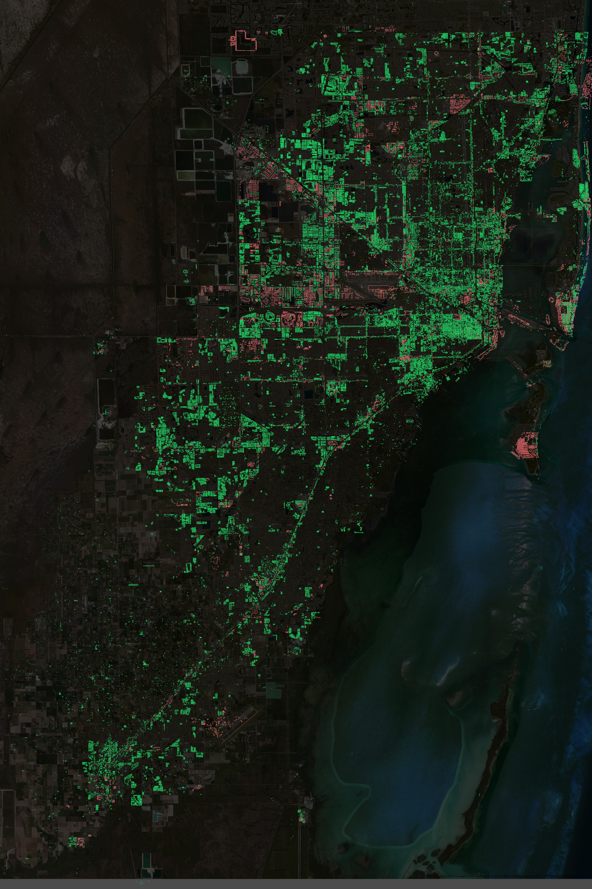

# Miami-Dade County Large Building Import

**The project is currently in the planning stage. Nothing is permanent yet.**

Software tools and technical description of the Miami-Dade County Large Building Import process.

More info on the [Wiki](http://wiki.openstreetmap.org/wiki/Miami-Dade_County_Large_Building_Import).

The documentation is a mess. Well, it's not really a documentation yet but a collections of notes and ideas during the planning stage. Don't worry. It'll be nice and clean once we're done.




## Prerequisites 

Python 2.7.

Install `PostgreSQL` with `PostGIS` on your system. You can find some help [here](http://wiki.openstreetmap.org/wiki/PostGIS/Installation#).

You will also need the [`psycopg2`](http://initd.org/psycopg/docs/install.html#install-from-package) and `requests` python packages.

Install osmosis with `apt-get install osmosis` on Ubuntu/Debian (other platforms see http://wiki.openstreetmap.org/wiki/Osmosis/Installation).

Install `GDAL/OGR` for your system. Used for importing shapefiles to Postgres with `ogr2ogr`.

PLUS `osmconvert`, `ogr2osm`, ...

## Data preparation [Under Construction]

- Create a PostgreSQL database called osmbuildings_miami (make sure user 'postgres' with the password 'postgres' has access to it). I might make this more flexible later because right now this is kind of hardcoded into the source
- Set up the DB (extensions, tables)
```
python data_prep/main.py --setup
```

### Get the data

- Import shapefiles to db. (I store the shapefiles in the data folder. pass it as the first argument)
```
./data_prep/import_shapefiles.sh data
```
- Grab buildings from OverpassAPI (store them in osm_buildings table)
```
python data_prep/main.py --buildings_download
```
- Grab Addresses from OverpassAPI (osm_addresses table)
```
python data_prep/main.py --address_download
```
- Grab highways/railways from OverpassAPI (osm_highway_railway)
```
python data_prep/main.py --roads_download

```
### Prepare the data for conversion

- Add indexes:
```
python data_prep/main.py --index_data
```
- Update db statistics:
```
python data_prep/main.py --vacuum
```
- Spatial intersection between Large Buildings and osm_buildings. Will result in 2 tables - buildings_no_overlap (for the bulk process) and buildings_overlap (for manually merging them with OSM)
```
python data_prep/main.py --intersect
```
- Delete buildings with logical errors (small area, misplaced "whole")
 ```
python data_prep/main.py --delete_err
 ```
- Assign address to 'buildings_no_overlap' where there's 1-1 building-address relation
```
python data_prep/main.py --assign_address
```
- Move self intersecting buidlings to manual bucket.
```
python data_prep/main.py --move_self_intersect
```
- Check if buildings are near existing OSM addresses. Move those that are closer than 30m to manual bucket.
```
python data_prep/main.py --check_address
```
- Check if buildings overlap with OSM roads/rail tracks. Move overlapping ones to manual bucket.
```
python data_prep/main.py --check_road_rail
```
- Check numbers
```
python data_prep/main.py --report
```

You should have 2 tables: `buildings_no_overlap` for the bulk process (i.e. buildings not interfering with existing OSM data) and `buildings_overlap` for the manual process (i.e. buildings that need manual inspection).

## Data conversion

- Clone `ogr2osm` in parent directory
```
cd ..
sudo apt-get install -y python-gdal python-lxml
git clone --recursive https://github.com/pnorman/ogr2osm
```

- Navigate back to `MiamiOSM-buildings` and convert `buildings_no_overlap` t an *.osm file (manual bucket)
```
cd MiamiOSM-buildings
./data_conversion/generate_osm_files.sh bulk
```

- Generate supplementary files with overlapping buildings and addresses for each block group
```
./data_conversion/generate_osm_files.sh review
```
